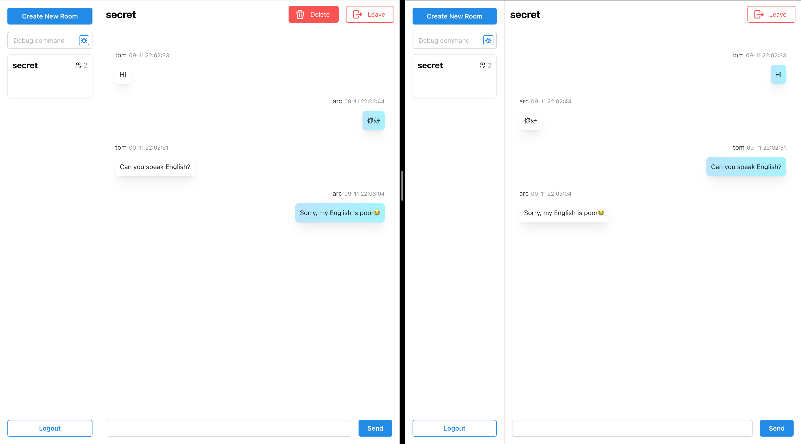

# Chat Tool

Real-time chatting, built with React, Remix and [actix-web](https://actix.rs/).

For learning purpose only.

### Prerequisites

1. Node.js
2. Rust
3. [diesel-cli](https://diesel.rs/guides/getting-started.html)
4. Sqlite

### Steps

1. Setup db
   1. `diesel setup`
   2. `diesel migration run`
2. Install dependencies

   `cd frontend` && `pnpm install` (or whatever package manager you prefer)

3. Build React

   `pnpm build`

4. Start server
    1. Back to root folder: `cd ../`
    2. `cargo run`

